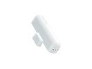
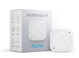
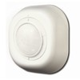
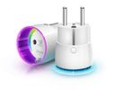
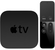
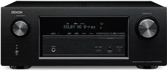
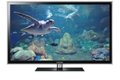

# Live in Comfort aka my Home Assistant Configuration
I tried [Home Assistant](https://home-assistant.io/) a couple of years ago, put it aside again, because then it wasn't there where I needed it to be.
Recently I reinstalled Home Assistant to integrate all the various systems I use for controlling our home.

In an effort to document my configuration I created this repository.

## Table of Contents
* [Base](#base)
* [My devices, services, and software I use](#my-devices-services-and-software-i-use)
    * [Audio / video](#audio--video)
    * [Network / Wireless](#network--wireless)
    * [Energy](#energy)
    * [Health](#health)
    * [Environment](#environment)
    * [Presence](#presence)
    * [Heating](#heating)
    * [Calendar](#calendar)
    * [Storage](#storage)
    * [Computers](#computers)
    * [Various](#various)

## Base
The base of my smart home is a Z-Wave network, created by the ZWay board for Raspberry Pi. Sensors and switches are controlled then through a MQTT message bus. To create automation and a user interface I use Home Assistant, which is running on a virtual machine on VMware vSphere.

[Table of Contents](#table-of-contents)

## My devices, services, and software I use

Device | Quantity | More info | Image 
--- | --- | --- | ---
Aeotec Door/window sensor 7| 3 | | 
Aeotec multi Sensor| 3 | [Aeotec Multi Sensor ](https://aeotec.com/z-wave-sensor/) | 
EverSpring Z-Wave PIR Sensor SP814  | 1 | [EverSpring sensor](http://www.everspring.com/portfolio-item/sp814-lens-changeable-pir-detector/) | 
Fibaro Wall Plug FGWPE-101 (Z-Wave)| 16 | [Fibaro wall plug](https://www.fibaro.com/en/products/wall-plug/) | 
Philips Hue lighting | |
Ikea Tradfri | |

[Table of Contents](#table-of-contents)

## Audio / Video

Vendor | Device | |
--- | --- | --- 
Apple | Apple TV |  | 
Denon |  X2100W AVR | 
Plex | Plex |  
Spotify | Spotify | 
Samsung | Samsung UE46D6200 |  

[Table of Contents](#table-of-contents)

## Network / Wireless
Kind | explanation
--- | --- 
Pi-Hole | Ad-blocker
Unifi | Network & Wireless

[Table of Contents](#table-of-contents)

## Energy
Kind | explanation
--- | --- 
PVOutput | Solar totals
SolarEdge | Solar Panels

[Table of Contents](#table-of-contents)

## Health
Kind | explanation
--- | --- 
FitBit | Fitbit wife
MyFitnessPal | My own health

[Table of Contents](#table-of-contents)

## Environment
Kind | explanation
--- | --- 
Luftdaten | Air conditition

[Table of Contents](#table-of-contents)

## Presence
Kind | explanation
--- | --- 
Owntracks |
ESP32 | Home Bluetooth presence detection

[Table of Contents](#table-of-contents)

## Heating
Kind | explanation
--- | --- 
Alpha Innotec | Air-Water heatpump

[Table of Contents](#table-of-contents)

## Calendar
Kind | explanation
--- | --- 
Google Calendar |

[Table of Contents](#table-of-contents)

## Storage
Kind | explanation
--- | --- 
Synology | Storage

[Table of Contents](#table-of-contents)

## Various
Kind | explanation
--- | --- 
MQTT | Message bus
BMW ConnectedDrive | Car information
RDW | Information about our cars
P2000 | Information about Ambulance/police/firebrigade

[Table of Contents](#table-of-contents)

## Computers
Kind | explanation
--- | --- 
Raspberry Pi | Z-Way Z-Wave network
Intel Nuc i5 (3x) | VMware cluster containing various items, including home automation items like Home Assistant

[Table of Contents](#table-of-contents)